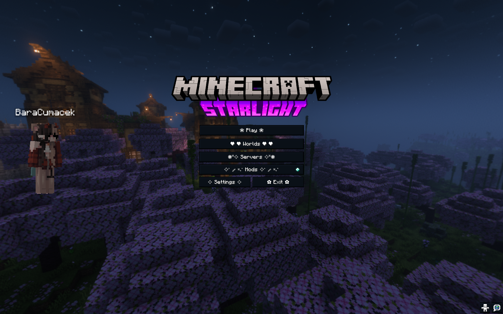
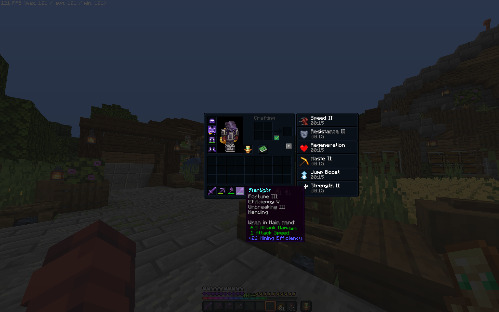
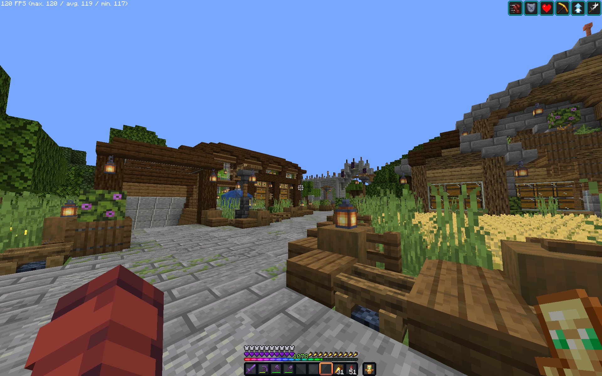

<p align="center">
  
</p>

<!-- MODRINTH_REMOVE_START -->
<h1 align="center">𝙎𝙏𝘼𝙍𝙇𝙄𝙂𝙃𝙏</h1>
<!-- MODRINTH_REMOVE_END -->

<p align="center">
    <a href="https://fabricmc.net/">
        
    </a>
    <a href="https://www.minecraft.net/en-us/article/minecraft-java-edition-1-21">
        
    </a>
    <a href="https://modrinth.com/project/kWqlGiOE">
        
    </a>
    <a href="https://packwiz.infra.link/">
        
    </a>
    <a href="https://github.com/my-daarlin/starlight">
        
    </a>
</p>

This modpack is built to feel like **Minecraft, but smoother and faster** — a seamless blend of vanilla fidelity and technical power.

### ✨ Features:

- ⚙️ **Performance** — powered by mods like Sodium, Lithium, and FerriteCore for a lightweight, high-FPS experience
- 🧠 **Technical utility** — includes tools like Carpet, MiniHUD, WorldEdit, and others for redstoners and world builders
- 💖 **Quality of life** — better UI, tooltips, world maps, and helpful tweaks without disrupting the vanilla flow

🎨 Designed to stay **true to vanilla**, while offering subtle enhancements for players who want more — without _feeling_ like a modded pack.

<!-- MODRINTH_REMOVE_START -->

## 📦 Installation

### 💚 Modrinth Launcher (Recommended)

1. Install the [Modrinth App](https://modrinth.com/app)
2. Search for **Starlight**, or visit [the website](https://modrinth.com/project/kWqlGiOE)
3. Click **Install**

---

## 🧑‍💻 Development Guide

Starlight uses [Packwiz](https://packwiz.infra.link/) for modpack management. This allows simple mod additions, version locking, and repeatable builds via Git. To install it, first [install the Go language](https://go.dev/doc/install) and then run this command:

```bash
go install github.com/packwiz/packwiz@latest
```

### 💚 Adding Modrinth content

```bash
packwiz modrinth add <mod-slug>
```

This will create a `.toml` file in `mods/` for the mod.

> [!WARNING]
> Do not use any other packwiz library other than Modrinth (Curseforge etc.). It would break all the project automatization and scripts. Add it like you would add custom content.

### 💜 Adding custom content

There is an `override` folder in the project. Everything from there will get merged with the project files during packaging. For example if I have a custom mod, I will place it in `overrides/mods/mod.jar` and during packaging, it will be put into `root/mods`. You can also use it for other custom content, like default option file (should be in `overrides/options.txt`) or the config directory.

### ↔️ Update All Mods

```bash
packwiz update -a
```

### 📆 Export

To generate a `.mrpack` file for Modrinth or manual distribution, use the `package.sh` script. To run it, go to the project root, and execute the following:

```bash
sh package.sh
```

This will include:

- All mod `.jar` links and metadata
- Everything from the `overrides/` folder (config, resourcepacks, etc.)
- Anything else in the repository not included in the `.packwizignore` file

To generate a mod list with mod names and modrinth links (NOT including custom content in `overrides`), run the `generate-modlist.sh` script by running:

```bash
sh update-content-list.sh
```

This script will generate all a list of all Packwiz content and its links, and will paste it between tartget HTML comments.

> [!WARNING]
> Running this script will replace all text in between those tags (to remove the old modlist). Do not write anything you want to keep in there!

<!-- MODRINTH_REMOVE_END -->

## 📜 Mod List

This is a list of all content included in the modpack with names and source links.

### 💚 Modrinth Content

Modrinth content in it's latest versions. Managed by `packwiz`.

<!-- MODLIST_START -->

| Name                                        | Type        | Source                                        |
| ------------------------------------------- | ----------- | --------------------------------------------- |
| "Limitless" Banners                         | Mod         | [Modrinth](https://modrinth.com/mod/z4zsMANd) |
| Architectury API                            | Mod         | [Modrinth](https://modrinth.com/mod/lhGA9TYQ) |
| BadOptimizations                            | Mod         | [Modrinth](https://modrinth.com/mod/g96Z4WVZ) |
| Beam Be Gone                                | Mod         | [Modrinth](https://modrinth.com/mod/6B5InQA5) |
| Concurrent Chunk Management Engine (Fabric) | Mod         | [Modrinth](https://modrinth.com/mod/VSNURh3q) |
| Carpet                                      | Mod         | [Modrinth](https://modrinth.com/mod/TQTTVgYE) |
| Clearviews                                  | Mod         | [Modrinth](https://modrinth.com/mod/TwYypE5e) |
| ClickThrough Plus                           | Mod         | [Modrinth](https://modrinth.com/mod/fJi8nm80) |
| Cloth Config API                            | Mod         | [Modrinth](https://modrinth.com/mod/9s6osm5g) |
| Collective                                  | Mod         | [Modrinth](https://modrinth.com/mod/e0M1UDsY) |
| Continuity                                  | Mod         | [Modrinth](https://modrinth.com/mod/1IjD5062) |
| Custom LAN                                  | Mod         | [Modrinth](https://modrinth.com/mod/OCvCFPNR) |
| Dynamic FPS                                 | Mod         | [Modrinth](https://modrinth.com/mod/LQ3K71Q1) |
| Enhanced Block Entities                     | Mod         | [Modrinth](https://modrinth.com/mod/OVuFYfre) |
| Enderman Grief                              | Mod         | [Modrinth](https://modrinth.com/mod/LLomXBnX) |
| Entity Culling                              | Mod         | [Modrinth](https://modrinth.com/mod/NNAgCjsB) |
| Fabric API                                  | Mod         | [Modrinth](https://modrinth.com/mod/P7dR8mSH) |
| Fabric Language Kotlin                      | Mod         | [Modrinth](https://modrinth.com/mod/Ha28R6CL) |
| FancyMenu                                   | Mod         | [Modrinth](https://modrinth.com/mod/Wq5SjeWM) |
| FerriteCore                                 | Mod         | [Modrinth](https://modrinth.com/mod/uXXizFIs) |
| Freecam                                     | Mod         | [Modrinth](https://modrinth.com/mod/XeEZ3fK2) |
| ImmediatelyFast                             | Mod         | [Modrinth](https://modrinth.com/mod/5ZwdcRci) |
| The Immersive Music Mod                     | Mod         | [Modrinth](https://modrinth.com/mod/EgBj3Bnf) |
| Inventory Profiles Next                     | Mod         | [Modrinth](https://modrinth.com/mod/O7RBXm3n) |
| Iris Shaders                                | Mod         | [Modrinth](https://modrinth.com/mod/YL57xq9U) |
| Jade 🔍                                     | Mod         | [Modrinth](https://modrinth.com/mod/nvQzSEkH) |
| Konkrete                                    | Mod         | [Modrinth](https://modrinth.com/mod/J81TRJWm) |
| Ksyxis                                      | Mod         | [Modrinth](https://modrinth.com/mod/2ecVyZ49) |
| libIPN                                      | Mod         | [Modrinth](https://modrinth.com/mod/onSQdWhM) |
| Lighty                                      | Mod         | [Modrinth](https://modrinth.com/mod/yjvKidNM) |
| Litematica                                  | Mod         | [Modrinth](https://modrinth.com/mod/bEpr0Arc) |
| Lithium                                     | Mod         | [Modrinth](https://modrinth.com/mod/gvQqBUqZ) |
| MaLiLib                                     | Mod         | [Modrinth](https://modrinth.com/mod/GcWjdA9I) |
| Melody                                      | Mod         | [Modrinth](https://modrinth.com/mod/CVT4pFB2) |
| MiniHUD                                     | Mod         | [Modrinth](https://modrinth.com/mod/UMxybHE8) |
| ModernFix                                   | Mod         | [Modrinth](https://modrinth.com/mod/nmDcB62a) |
| Mod Menu                                    | Mod         | [Modrinth](https://modrinth.com/mod/mOgUt4GM) |
| No More Phantoms                            | Mod         | [Modrinth](https://modrinth.com/mod/Oe1SVpwg) |
| No Fortune Chest                            | Mod         | [Modrinth](https://modrinth.com/mod/4QufRNTv) |
| Text Placeholder API                        | Mod         | [Modrinth](https://modrinth.com/mod/eXts2L7r) |
| Reese's Sodium Options                      | Mod         | [Modrinth](https://modrinth.com/mod/Bh37bMuy) |
| Roughly Enough Items (REI)                  | Mod         | [Modrinth](https://modrinth.com/mod/nfn13YXA) |
| Shulker Box Tooltip                         | Mod         | [Modrinth](https://modrinth.com/mod/2M01OLQq) |
| Sodium Extra                                | Mod         | [Modrinth](https://modrinth.com/mod/PtjYWJkn) |
| Sodium                                      | Mod         | [Modrinth](https://modrinth.com/mod/AANobbMI) |
| Teleport Commands                           | Mod         | [Modrinth](https://modrinth.com/mod/3ne670on) |
| ThreadTweak                                 | Mod         | [Modrinth](https://modrinth.com/mod/vSEH1ERy) |
| Tweakeroo                                   | Mod         | [Modrinth](https://modrinth.com/mod/t5wuYk45) |
| Very Many Players (Fabric)                  | Mod         | [Modrinth](https://modrinth.com/mod/wnEe9KBa) |
| WI Zoom                                     | Mod         | [Modrinth](https://modrinth.com/mod/o7DitHWP) |
| WorldEdit                                   | Mod         | [Modrinth](https://modrinth.com/mod/1u6JkXh5) |
| Xaero's World Map                           | Mod         | [Modrinth](https://modrinth.com/mod/NcUtCpym) |
| 1.20 panorama with shaders (night)          | Texturepack | [Modrinth](https://modrinth.com/mod/HmYNU7gu) |
| Fast Better Grass                           | Texturepack | [Modrinth](https://modrinth.com/mod/dspVZXKP) |
| Mob Crates                                  | Texturepack | [Modrinth](https://modrinth.com/mod/bYcjtBki) |
| New Glowing Ores                            | Texturepack | [Modrinth](https://modrinth.com/mod/oL18adaQ) |
| 🌙 Night UI - A Dark Themed Resource Pack   | Texturepack | [Modrinth](https://modrinth.com/mod/JEGWvrJj) |
| Tiny Totem                                  | Texturepack | [Modrinth](https://modrinth.com/mod/rlVZIVlP) |

<!-- MODLIST_END -->

### 💜 External content

Non Modrinth content, or Modrinth content in a specific version. Not managed by `packwiz`.

| Name                     | Type        | Source                                                                                   |
| ------------------------ | ----------- | ---------------------------------------------------------------------------------------- |
| Offline Skins            | Mod         | [Curseforge](https://www.curseforge.com/minecraft/mc-mods/offlineskins-fabric)           |
| No Villager Idle Sounds  | Texturepack | [Curseforge](https://www.curseforge.com/minecraft/texture-packs/no-villager-idle-sounds) |
| Alternate Bedrock        | Texturepack | [VanillaTweaks](https://vanillatweaks.net/picker/resource-packs/)                        |
| Square Plus Crosshair    | Texturepack | [VanillaTweaks](https://vanillatweaks.net/picker/resource-packs/)                        |
| Brighter Nether          | Texturepack | [VanillaTweaks](https://vanillatweaks.net/picker/resource-packs/)                        |
| Golden Carrot Hunger Bar | Texturepack | [VanillaTweaks](https://vanillatweaks.net/picker/resource-packs/)                        |
| Purple Hearts            | Texturepack | [VanillaTweaks](https://vanillatweaks.net/picker/resource-packs/)                        |
| Quiter Minecarts         | Texturepack | [VanillaTweaks](https://vanillatweaks.net/picker/resource-packs/)                        |
| Quiter Nether Portals    | Texturepack | [VanillaTweaks](https://vanillatweaks.net/picker/resource-packs/)                        |
| Rainbow Expirience Bar   | Texturepack | [VanillaTweaks](https://vanillatweaks.net/picker/resource-packs/)                        |

## 📈 Performance data

_(Coming soon – will include how much fps it gets where)_

<!-- MODRINTH_REMOVE_START -->
<!-- Removed, because Modrinth has a Gallery tab -->

## 📸 Screenshots

<p align="center">
    
    
</p>
<p align="center">
    
    
</p>

<!-- MODRINTH_REMOVE_END -->

## 🌐 Credits & Resources

- This modpack uses mods and resource packs from [Modrinth](https://modrinth.com/), a community-driven platform for Minecraft modding.
- This modpack uses resource packs from the [Vanilla Tweaks](https://vanillatweaks.net/) portal.
- The [Offline Skins](https://www.curseforge.com/minecraft/mc-mods/offlineskins-fabric) mod was used from [Curseforge](https://www.curseforge.com/minecraft).
- The Starlight logo was created using [Blockbench](https://www.blockbench.net/) with a Minecraft text plugin. There is a video explaining how to do this [here](https://www.youtube.com/watch?v=iGaufrACVj4).

All mods are managed via [Packwiz](https://packwiz.infra.link/).

## 🧷 License

This project is open-source and intended for educational and personal use. All content included in the Starlight modpack remains under its respective license. Be kind, give credit, and have fun 🌱
